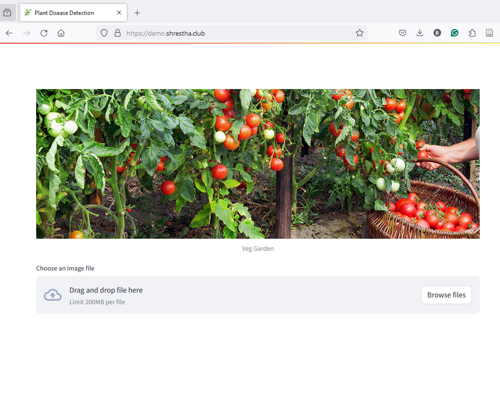

# Final Project - Plant Disease Prediction  
===
## Git repository, prospectus, final project website, and webapp
===
### Git Repository: 

- [Project Submission](https://github.com/BijeshShrestha/ML_GroupProject) used for demo and user testing
    
### Prospectus - Project Proposal

    The prospectus is included in the repository as "Prospectus_project_proposal.pdf" file in "docs" folder.

### Project Website

The project website is hosted at [▶️ Project Website](https://bijeshshrestha.github.io/ML_GroupProject/)

- The project website is the one-stop-shop for all the information related to the project. It includes the project description and instructions on how to run the project locally. 

### Plant Disease Prediction Webapp

The tool can be found here at [▶ webapp](https://demo.shrestha.club/). If the tool is not working, please follow the instructions below to run the project locally. You will need to have the openai api key to run the project locally.

Webapp screenshot:

